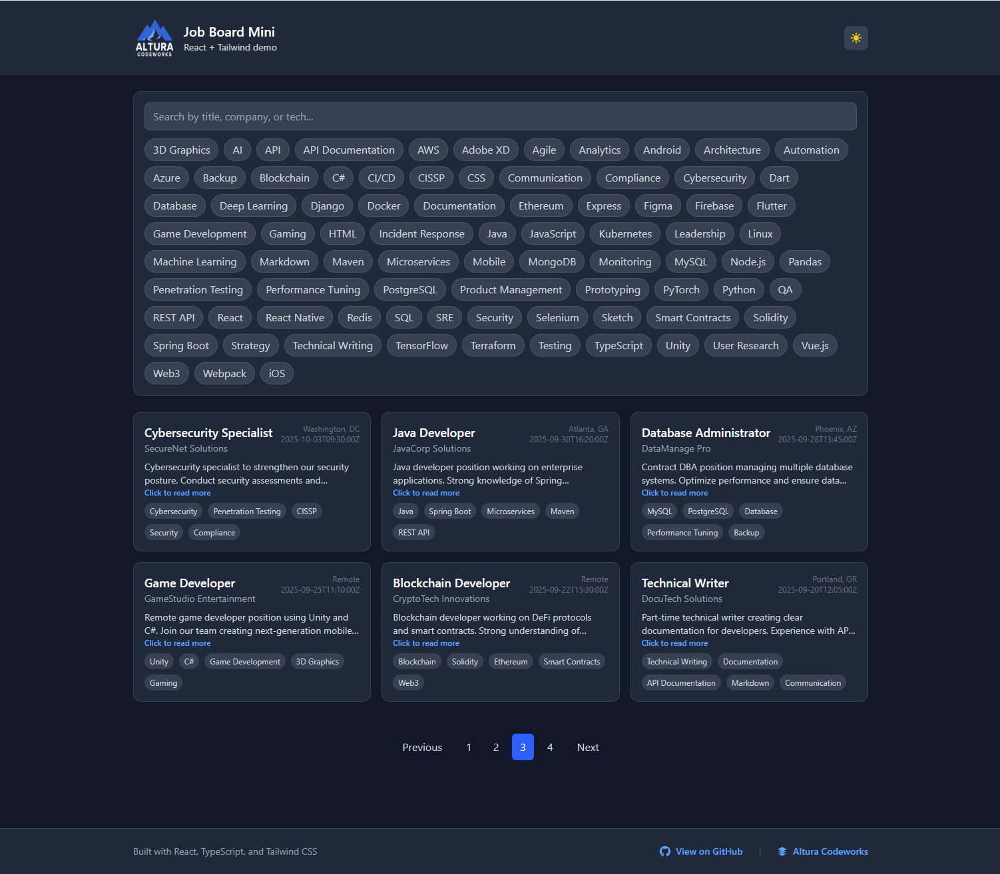
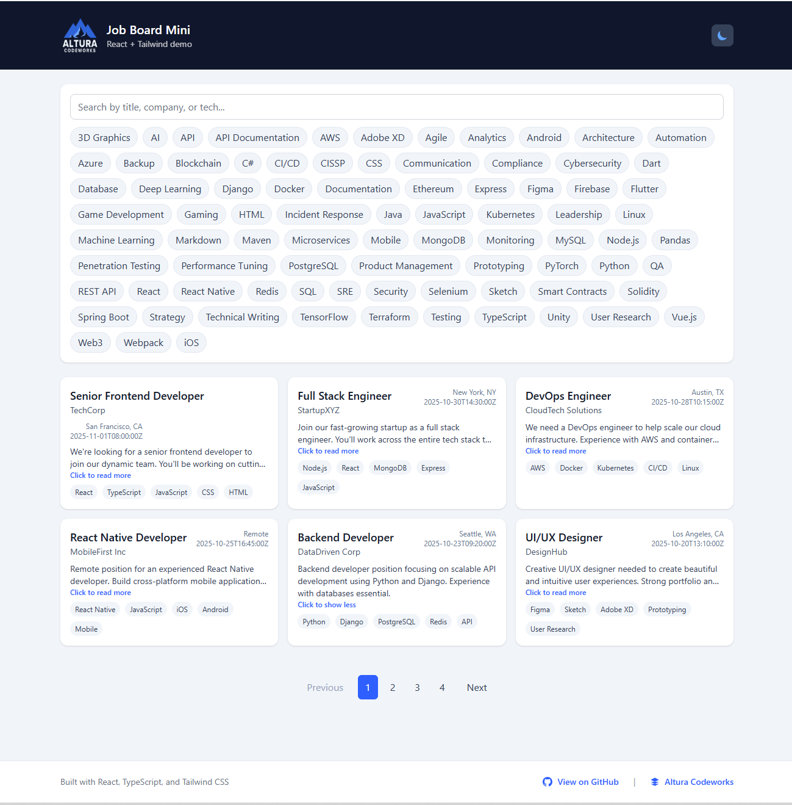

# Job Board Mini  
*A responsive React + Tailwind CSS demo showing filtering, pagination, and dark/light theming.*




---

## Live Demo
🔗 **[Open on Vercel](https://job-board-mini-demo-app.vercel.app)**  

---

## Tech Stack
| Layer | Technologies |
|-------|---------------|
| **Frontend** | React (Vite + TypeScript), Tailwind CSS |
| **State** | React Hooks + Context |
| **Data Source** | Static mock JSON (could be replaced with API) |
| **Features** | Dark mode, search, tag filtering, pagination |
| **Deployment** | Vercel / Netlify |

---

##  Features
- **Live search** — filter job postings by title, company, or tags  
- **Tag-based filtering** — click tech tags to refine results  
- **Dark & light modes** — fully styled with Tailwind’s `dark:` classes  
- **Pagination** — shows mock dataset in realistic pages  
- **Responsive** — adaptive grid layout for mobile & desktop  
- **Clean architecture** — hooks, components, and utility separation  

---

## Run Locally

```bash
# 1️⃣ Clone the repo
git clone https://github.com/ymykhal/job-board-mini-demo-app.git
cd job-board-mini-demo-app

# 2️⃣ Install dependencies
npm install

# 3️⃣ Start dev server
npm run dev
Open http://localhost:5173.

👨‍💻 Author

Yuriy Mykhalchuk
Founder of Altura Codeworks https://alturacodeworks.com/ 

🔗 LinkedIn https://www.linkedin.com/in/yuriy-mykhalchuk-b964ba10/
 · Upwork https://www.upwork.com/freelancers/~019fb7153779620a63

📄 License

MIT — free for demonstration and educational use.